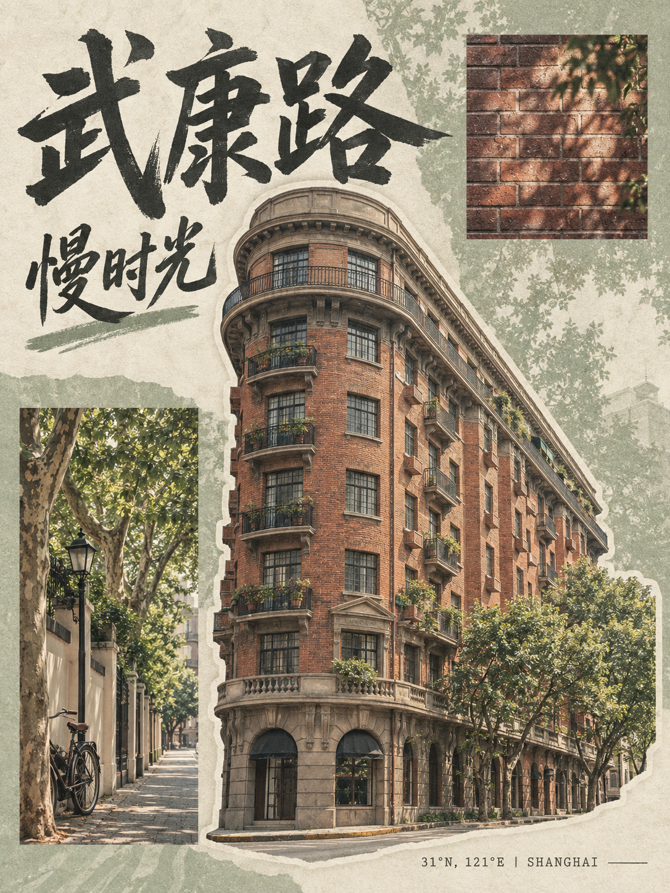
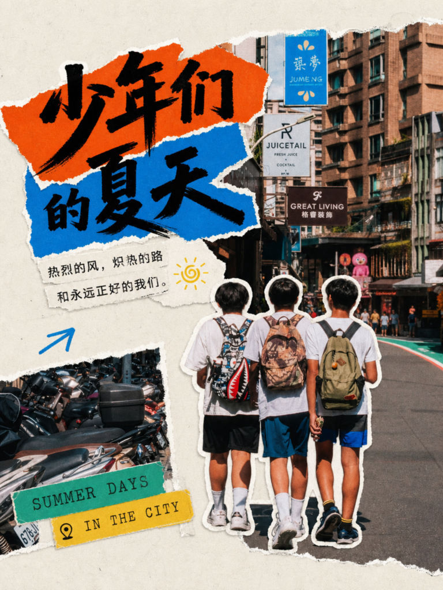

# 银溪小红书拼贴封面

**Yinxi XHS Collage Cover**

一个用于城市漫游、市井探店、旅行随笔和日常摄影的独立 Agent Skill。将生活影像转化为适合小红书的 **3:4 拼贴封面**，强调贴纸化主体、网格秩序和清透的印刷质感。

## 视觉特点

- **均衡呼吸**：画面饱满、有张力，但保留明确留白和网格秩序。
- **贴纸化主体**：主体以独立轮廓呈现，搭配细白边或撕纸边。
- **多层背景**：辅助照片块、纹理蒙版或放大的主体，避免单一底色。
- **文字互动**：厚重手写感标题，配打字机感或无衬线信息标签。
- **统一质感**：细微纸纹与 Riso 噪点，避免厚重、油腻的滤镜。

## 案例

案例用于展示视觉方向，不代表所有图片都由本仓库的 Skill 生成，也不代表已经验证真实照片抠图或可编辑图层。

### 武康路慢时光

本地首轮 Skill 风格试稿，使用整图生成，无现场照片。复古胶片色彩，建筑贴纸主体，砖墙与街道细节块。实际尺寸为 1086 × 1448，比例 3:4。建筑细节为生成内容，不作为真实建筑记录。



### 邻里间的烟火气

作者提供的视觉案例，并非本仓库已验证的生成结果。以邻里日常、撕纸标题与旧纸标签呈现市井生活；图中日期与坐标仅属于案例，不作为默认输入。


### 少年们的夏天

作者提供的视觉案例，并非本仓库已验证的生成结果。人物白边贴纸、街景层次与高对比色块呈现城市夏日的活力。



## 安装

Skill 入口为 [`SKILL.md`](SKILL.md)。使用支持 `SKILL.md` 的 Agent，并确保环境具有所需的图像能力。

### Codex

```bash
git clone https://github.com/lifafa0616/yinxi-xhs-collage-cover.git \
  ~/.codex/skills/yinxi-xhs-collage-cover
```

### Factory Droid

```bash
git clone https://github.com/lifafa0616/yinxi-xhs-collage-cover.git \
  ~/.factory/skills/yinxi-xhs-collage-cover
```

若目标目录已存在，不要覆盖；先检查现有内容。新安装后重新开启会话，让 Agent 发现 Skill。

## 使用

在对话中明确使用 `yinxi-xhs-collage-cover`，并提供：

| 输入 | 必填 | 说明 |
| --- | --- | --- |
| `topic` | 是 | 主题文案 |
| `sub_info` | 否 | 副标题、地点、坐标或日期 |
| `user_photos` | 否 | 本次提供的现场照片 |
| `color_style` | 否 | 高饱和对比（默认）、复古胶片感、活力明黄、低饱和市井灰 |

示例：

```text
使用 yinxi-xhs-collage-cover 制作小红书封面。
主题：武康路慢时光
补充信息：31°N, 121°E | SHANGHAI
色彩风格：复古胶片感
没有现场照片，请做生成式风格预览。
```

有照片时直接上传，并说明希望作为核心主体的人物、建筑或物件。只有明确提供的照片才进入素材流程。

## 能力边界

这是设计工作流与视觉规则，不是自带生图、抠图和字体服务的软件。

- **整图生成**：适合风格预览；图片不含独立可编辑图层，生成文字需检查。
- **真实照片合成**：需要主体分割或背景移除能力；不以生成相似主体冒充抠图。
- **换字体与可编辑交付**：需要支持图层的设计工具，或分离素材与文字的 HTML/SVG 工作流。PNG 不是图层母版。
- **比例与尺寸**：默认 3:4，目标 1080 × 1440；交付时以实际输出为准。

当前已测试整图风格生成。真实照片抠图、独立文字排版、字体替换和可编辑图层尚未验证。首轮试图的纸纹略重，后续可加强清透感和标题与主体的互动。

## 文件结构

```text
yinxi-xhs-collage-cover/
├── SKILL.md
├── README.md
└── examples/
    ├── wukang-road.png
    ├── neighborhood-life.jpeg
    └── summer-in-the-city.jpeg
```

案例图片用于视觉展示；公开展示不等于授予图片再使用或再分发许可。
